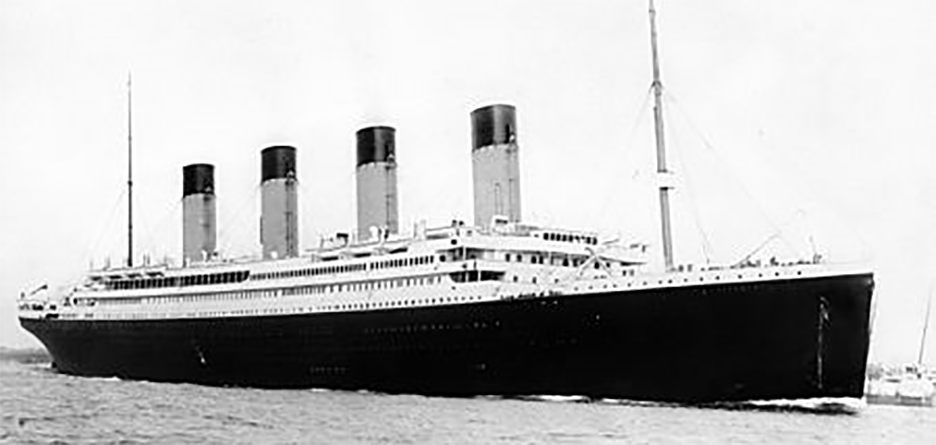
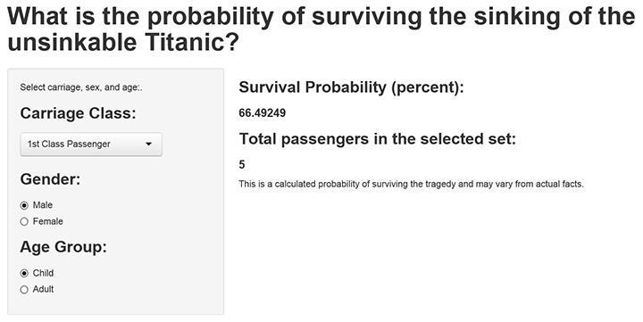

The Titanic Disaster: Who was most likely to survive?
========================================================
title:Titanic Survivor Prediction
author:Michael Reed
date: 10.6.2014
transition: rotate
font-family: 'MoolBoran'
type: sub-section

# Survivor Prediction
## By Carriage Class, Gender, Age

Titanic Passenger Survival Prediction
========================================================

At the time of the infamous sinking of the unsinkable Titanic cruise ship, 'class' systems prevailed in most European countries and was reflected in the Carriage Classes onboard the ship. This experiment predicts the survival rate of the passengers based on their Carriage Class, Gender, and Age.  



Summary of Data Set:
========================================================

The R datasets package Titanic data was used to prepare a Generalized Linear Prediction model which, when supplied the user-selected inputs, returns the survival percentage for that particular combination of Carriage Class, Gender, and Age.
<br>

Data Description<br>
32 Observations, 5 Variables<br>
(Class, Sex, Age, Survived, Frequency)
***
Figure 1. Data summary

```r
str(Titanic)
```

```
 table [1:4, 1:2, 1:2, 1:2] 0 0 35 0 0 0 17 0 118 154 ...
 - attr(*, "dimnames")=List of 4
  ..$ Class   : chr [1:4] "1st" "2nd" "3rd" "Crew"
  ..$ Sex     : chr [1:2] "Male" "Female"
  ..$ Age     : chr [1:2] "Child" "Adult"
  ..$ Survived: chr [1:2] "No" "Yes"
```


Prediction Calculation
========================================================

I used a glm algorithm model trained on the R Datasets Titanic data to prepare the prediction model. A simple Predict function accepts the user input as New Data and executes the prediction which is then returned to the UI by the Server object.
<br>
I am also calculating the total count of passengers in the specified Class/Gender/Age group which is also returned to the UI and displayed where the user is, by design, forced to apply the survival percentage to the count which I believe creates a bigger impact than doing the calculation for them.


Prediction Results
========================================================

The interactive Shiny application can be accessed at this link:<br>
http://mreeddev.shinyapps.io/ShinyProject/<br><br>
Figure 3 Image of Titanic survivor Calculation App


